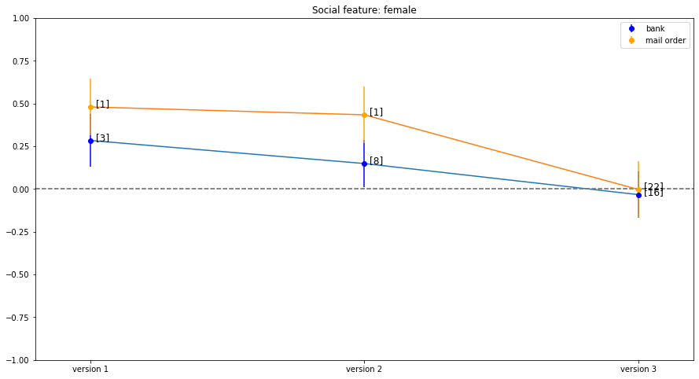
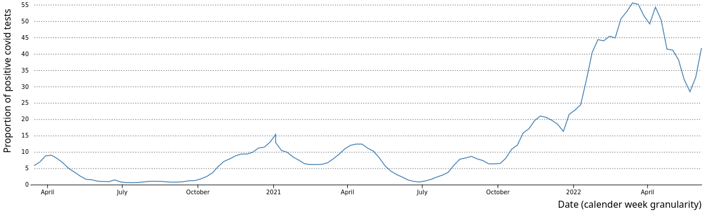
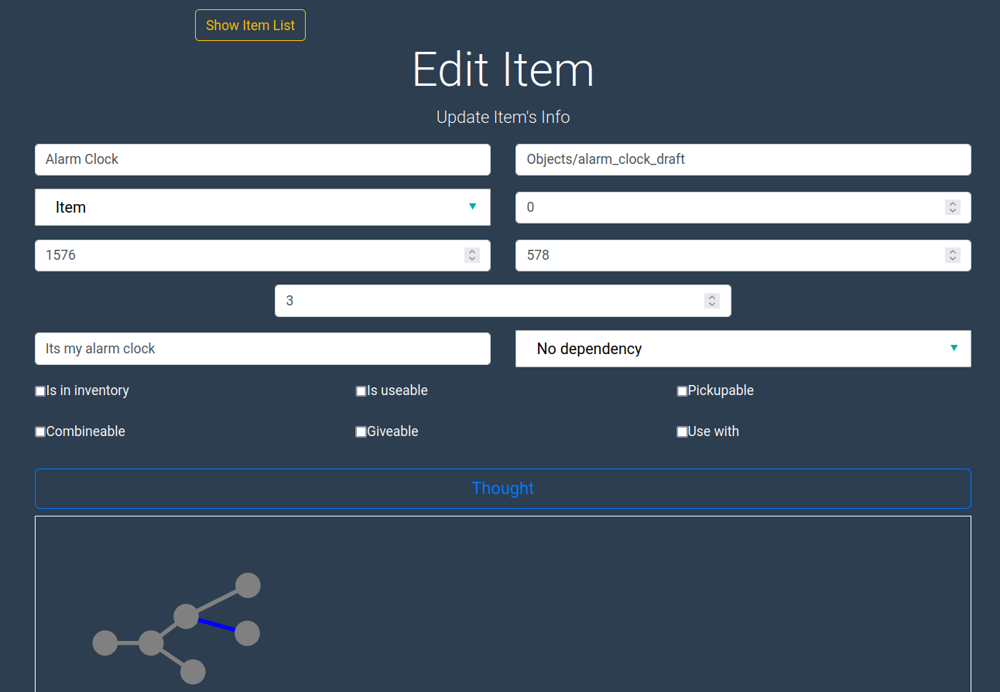
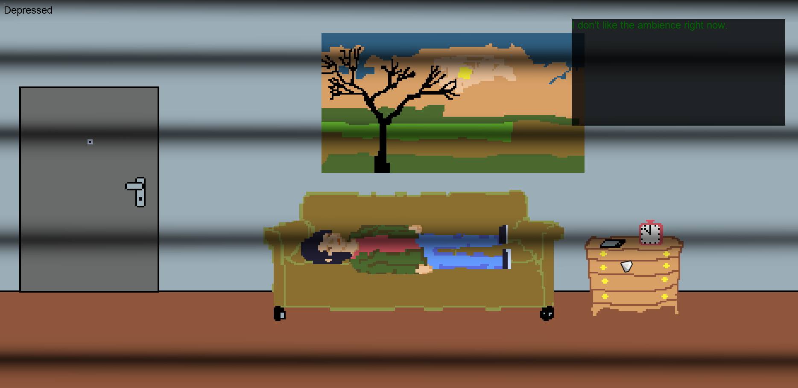
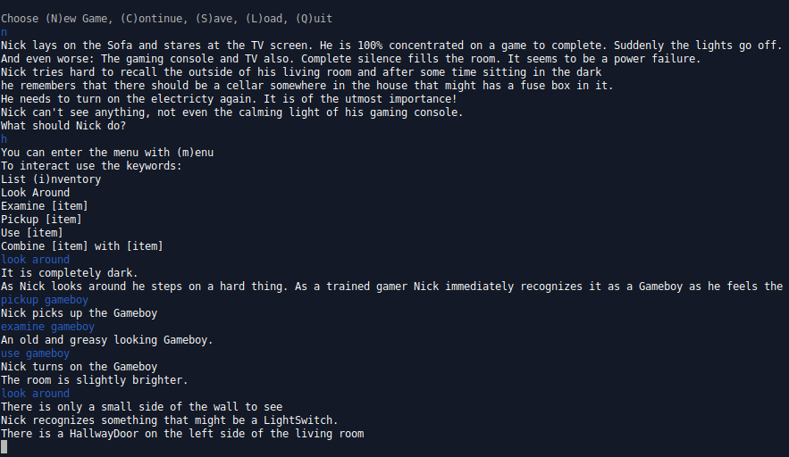
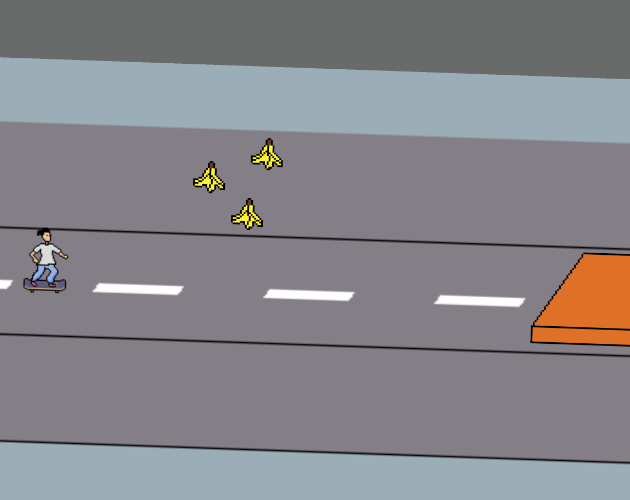
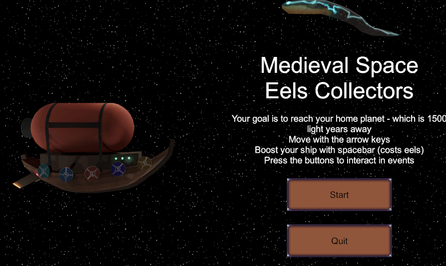

# waackph

## About me

Hi, I am Philipp. I am currently working as a developer with an interdisciplinary overlap between data ethics, data governance and data science.

I am a very curious person which is why I have even two main fields of interesst I love to work in:
- Journalism: I am interested in journalism, especially the intersection of quantitative methods and visualization with qualitative journalistic storytelling.
- Video Games: My other big passion is developing video games, where many different art forms come together. See show cases of games [here](https://waackph.itch.io/).

## Career

- Currently: Developer at acs plus
- 2016-2019: Master of Science; Computer science, Humboldt Universität zu Berlin; Thesis: _Empirical study about the influence of social dimensions on the SCHUFA-Score_
- 2012-2016: Bachelor of Science; Media and computer science, Technische Universität Dresden; Thesis: _Benutzbarkeitskonzept für VPN-basierte Anonymisierung mobiler Geräte_

For detailed information about my experience and skills see my CV ([en](cv/en/cv_en.pdf), [de](cv/de/cv_de.pdf)). 

## Work Samples

### Data analysis and visualizations

#### Case study about the influence of social dimensions on solvency scores

The result of this [project](https://waackph.github.io/solvency_scoring_social_bias_analysis/) is the master thesis
[Empirical Study about the Influence of Social Dimensions on the SCHUFA-Score](resources/Empirical_Study_about_the_Influence_of_Social_Dimensions_on_the_SCHUFA-Score.pdf). The data set the analysis is based on is provided by the openSCHUFA project which consisted of the AlgorithmWatch Initiative and the Open Knowledge Foundation in 2018. A structured form of the data set for this thesis was provided by the data team of SPIEGEL Online.

The goal of the study is to analyse the influence of selected social dimensions on the different versions of selected sector scores of the SCHUFA solvency score. This is meant to start a discussion on how algorithmic systems potentially take part in reproducing a disparate distribution of resources by explicitly using or implicitly reflecting social dimensions in the output they produce. What parts of it do we as a society accept and what needs to be taken into account by the constructors and users of such algorithms?

In this project the discussion takes place along the case study of the SCHUFA solvency scores. 

 
Standardized coefficient of the linear regression of female feature per version of the bank and mail order sector score
  

A key result was the analysis of influences of the selected social dimensions of age, being female and being from historic east part of germany on selected sector SCHUFA scores banking and mail order w.r.t. all three versions of the scores. The figure is a summarizing but also simplifing result. It shows a small positive effect especially in the mail order score when being of female sex in the openSCHUFA data set. This effect reduces heavily with the score version. The analysis was conducted using a multivariate parameteric linear regression model and a non-parameteric gaussian processs model. Both have indicators concerning the influence of dimensions. The data set for each analysis was prepared using a matching algorithm to control for other possible predictive features.

A main challenge of the project were the limitations of the data set with its many biases and the missing information of how the SCHUFA scores are actually build. Hence, the results can only be viewed in context of the analysed data set. Nevertheless, it provides interessting points that can be discussed further. More information can be found [here](https://waackph.github.io/solvency_scoring_social_bias_analysis/).

* * *

#### Corona Pandemic Visualization examples

The [project](https://waackph.github.io/pandemic_visualizations/) is the result of some experimenting and exercise with data related to the corona pandemic. Data sets from different sources are used to analyse questions such as: What influence had the dominant covid variant on the number of covid cases? 
First, a simple descriptive analysis has been done using a jupyter notebook in python. The resulting interactive versions of the plots are implemented with D3.js and Bootstrap.

 

 

More information can be found [here](https://waackph.github.io/pandemic_visualizations/).

* * *

### Game Development

#### Conscious Game Engine
The conscious game engine consists of the game mechanics implementation which consistutes the [game engine backend](https://github.com/waackph/conscious-game) - created in Monogame C# framework - and the [content generation tool](https://github.com/waackph/Game-Content-Tool) - implemented as a web application with React.js as frontend, Express.js as backend and MongoDB as NoSQL database. See more information also on [itch.io](https://waackph.itch.io/conscious-content-tool).

 

 

* * *

#### Getting Up is Hard
A small point-and-click prototype created with the conscious game engine, which is based on the Monogame C# Framework. See more information at [itch.io](https://waackph.itch.io/getting-up-is-hard).

 

 

* * *

#### The Power Outage Incident
A small text adventure prototype in plain C#. See more information at [itch.io](https://waackph.itch.io/the-power-outage-incident).

 

 

* * *

#### HellSkate
A small text adventure prototype in plain C#. See more information at [itch.io](https://waackph.itch.io/hellskate).

 

 

* * *

<!-- 
#### Medieval Space Eel Collector
A small text adventure prototype in plain C#. See more information at [itch.io](https://waackph.itch.io/medieval-space-eel-collector).

 

 

* * *
-->

## Contact

- You can contact me via E-Mail: waackphilipp [at] gmail.com
- My [GitHub Profile](https://github.com/waackph)
- My [itch.io Profile](https://waackph.itch.io/)
